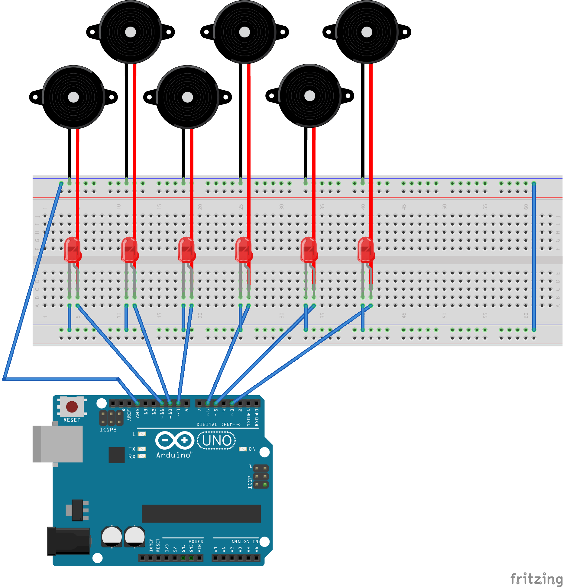

# Luces Arduino with [johnny-five](https://github.com/rwaldron/johnny-five)

## Setup

Clone this repository:

```sh
git clone https://github.com/mrpatiwi/luces-arduino.git
cd luces-arduino
```

Install dependencies

```sh
npm install
```

Setup your hardware:

> Follow the initial setup at https://github.com/rwaldron/johnny-five/wiki/Getting-Started

Arduino configuration:




Change the server endpoint url in the file [index.js](index.js):

```js
const host = 'http://luces-api.lopezjuri.com'
```

Run the project:

```sh
npm start
```
